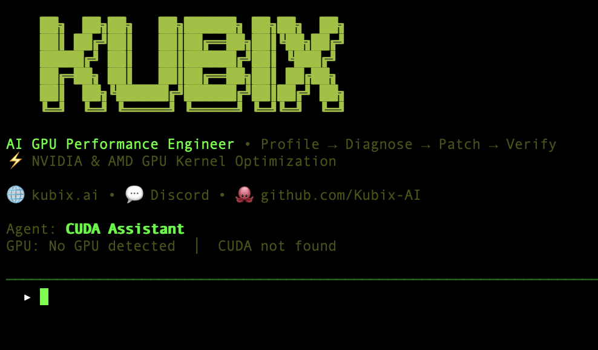

# Kubix CLI - AI agent that actually understands GPU architecture

```
   ██╗  ██╗██╗   ██╗██████╗ ██╗██╗  ██╗
   ██║ ██╔╝██║   ██║██╔══██╗██║╚██╗██╔╝
   █████╔╝ ██║   ██║██████╔╝██║ ╚███╔╝
   ██╔═██╗ ██║   ██║██╔══██╗██║ ██╔██╗
   ██║  ██╗╚██████╔╝██████╔╝██║██╔╝ ██╗
   ╚═╝  ╚═╝ ╚═════╝ ╚═════╝ ╚═╝╚═╝  ╚═╝

                    CUDA AI Assistant • Open Source
```

> **Open Source CLI Tool** - Want a full-featured CUDA development environment with code completion, integrated debugging, and advanced AI features?
> Try **Kubix Code Editor** - Our complete IDE for GPU development.

**Kubix CLI** is an AI-powered CUDA development assistant that helps you write, optimize, and debug GPU code. Start FREE with no credit card required!

<p align="center">
  
</p>

---

## Quick Install (30 seconds)

### Option 1: pip (Recommended)
```bash
pip install kubix-cli
```

### Option 2: Quick Install Scripts

**Linux/macOS:**
```bash
curl -sSL [url] | bash
```

**Windows (PowerShell as Admin):**
```powershell
irm [url] | iex
```

## Getting Started (2 minutes)

### 1. Get your FREE API key (30 seconds)
```bash
# Visit OpenRouter (no credit card needed!)
[url]

# Sign up with Google/GitHub for instant access
# Copy your API key from the dashboard
```

### 2. Start Kubix
```bash
kubix
# Paste your API key when prompted (one-time setup)
```

### 3. Start coding!
```
You: Create a vector addition CUDA kernel

Kubix: [Creates optimized kernel with detailed explanations]
```

## What Can It Do?

### For Beginners
- **Learn CUDA**: "Explain how CUDA threads work"
- **Write Code**: "Create a simple matrix multiplication kernel"
- **Fix Errors**: "Help! My kernel crashes with error X"

### For Experts
- **Optimize**: "Optimize this kernel for memory coalescing"
- **Debug**: "Find the race condition in my code"
- **Analyze**: "Profile this kernel and suggest improvements"

## Key Features

### Start FREE
- No credit card required
- Free models included (Google Gemini, Meta Llama)
- Upgrade to premium models when needed

### Smart AI Agents
- **General Assistant**: Helps with any CUDA task
- **Optimizer**: Maximizes performance
- **Debugger**: Finds and fixes bugs
- **Analyzer**: Explains and improves code

### Powerful Tools
- Read and write CUDA files
- Analyze performance bottlenecks
- Generate optimized variants
- Monitor GPU status
- Execute bash commands

## Example Usage

### Basic Commands
```bash
# Start interactive mode
kubix

# Inside Kubix:
/models     # List available AI models
/gpu        # Show GPU status
/clear      # Clear conversation
/help       # Show help
/quit       # Exit
```

### Example Conversations

**Creating a Kernel:**
```
You: Create a parallel reduction kernel

Kubix: [Writes complete kernel with shared memory optimization]
```

**Optimizing Code:**
```
You: Optimize my matrix multiplication for RTX 4090

Kubix: [Analyzes and provides optimized version with 10x speedup]
```

**Debugging:**
```
You: My kernel gives wrong results for large arrays

Kubix: [Identifies overflow issue and provides fix]
```

## Available Models

### Free Models (No cost!)
- **Google Gemini 2.0 Flash** - Fast and capable (default)
- **Meta Llama 3.2 3B** - Efficient for simple tasks

### Premium Models (Pay-per-use via OpenRouter)
- **GPT-4o** - Most capable overall
- **Claude 3.5 Sonnet** - Best for complex code
- **Gemini 1.5 Flash** - Fast with huge context

Switch models anytime with `/models` command!

## System Requirements

### Minimum
- Python 3.9+
- Any OS (Windows, Linux, macOS)
- Internet connection

### Recommended (for CUDA features)
- NVIDIA GPU (GTX 1650 or newer)
- CUDA Toolkit 11.0+
- 8GB+ RAM

## Troubleshooting

### "Command not found"
```bash
# Add to PATH (Linux/macOS)
export PATH="$HOME/.local/bin:$PATH"

# Or reinstall
pip uninstall kubix-cli
pip install kubix-cli --user
```

### "API key error"
```bash
# Get your free key at OpenRouter

# Clear old key and re-enter:
rm -rf ~/.kubix-cli
kubix  # Will prompt for new key
```

### GPU not detected
```bash
# Check NVIDIA driver
nvidia-smi

# Check CUDA
nvcc --version

# Kubix works without GPU (CPU simulation mode)
```

## Documentation

- **Installation Guide**: [INSTALLATION.md](INSTALLATION.md)
- **Contributing**: [CONTRIBUTING.md](CONTRIBUTING.md)

## Contributing

We welcome contributions! Please see [CONTRIBUTING.md](CONTRIBUTING.md) for guidelines.

## License

Proprietary Non-Commercial License - FREE for personal and educational use.
See [LICENSE](LICENSE) for details.

For commercial use, contact: hello@kubix.ai

## Support

- **Email**: hello@kubix.ai

---

<p align="center">
  <b>Built with <3 by the Kubix AI Team</b><br>
  <em>GPU Native AI Code Editor</em>
</p>
